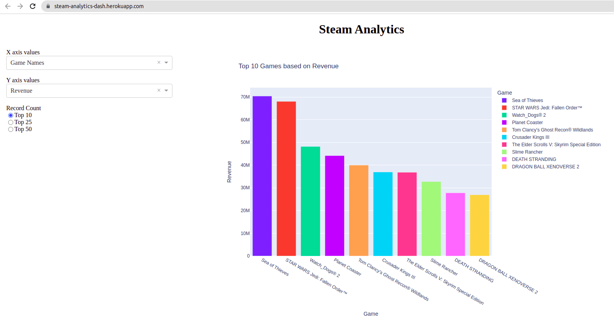

# Steam Analytics

This project will give you the insight about the games released by the gaming company. In this project we created the Flask and Dask website hosted on Heroku to show are finding in user interactive way.

We have create 2 application for this.  
First one is using **Flask** which has Minimum viable product(MVP) where we have displayed very basic information about the dataset.  
Second one is using **Dash** where we have created dashboard with many visuals to give more insights from game dataset. 

## Prerequisite to run the project

Python 3 should be install in you system.  
To install python you can follow the link [Install Python](https://realpython.com/installing-python/#how-to-install-python-on-macos)

Docker should be installed in your system.  
To install python you can follow the link [Install Docker](https://docs.docker.com/engine/install/)

Heroku Cli should installed if you want to deploy your application on Heroku.  
To install python you can follow the link [Install Docker](https://docs.docker.com/engine/install/)

## Usage

### Deploy project using docker

Checkout the project and in terminal go to folder `steam-analytics-deployment`. And follow below below steps as per your requirement.

- Deploy Application on local machine
  * open Docker file and uncomment `CMD ["app/steam_analytics.py"]` line to deploy flask application and for Dash application uncomment `CMD ["app/steam_analytics_dash.py"]`
  * run below command to create docker image
  
    `docker build -t <Image-name>:<tag-name> .`
    (replace image-name and tag-name as per your choice)
  * run below command to run you application using docker image file.
  
    `docker run -p 5000:5000 <image-name>`
  * open `http://127.0.0.1:5000/` link in your browser.
   
- Deploy Application to heroku 
  * open Docker file and uncomment `CMD ["app/steam_analytics.py"]` line to deploy flask application and for Dash application uncomment `CMD ["app/steam_analytics_dash.py"]`
  * create heroku app using below command
  
    `heroku create <app-name>`
  * run below command to create docker comtainer in heroku
  
    `heroku container:push web --app <app-name>`
  * run below command to release the container.
  
    `heroku container:release web --app <app-name>`
  * open your application using `https://<app-name>.herokuapp.com` link

### Run application locally without docker

- To run Flask application locally run `steam_analytics.py` file using below command.

  `python app/steam_analytics.py`
  
- To run Dash application locally run `steam_analytics_dash.py` file using below command.
  
  `python app/steam_analytics_dash.py`
  
## Visuals

After opening the application in browser you will see screens like below.

For MVP using Flask hosted on Heroku.


For dashboard using Plotly Dash hosted on Heroku.



## Insights

Most Valuable insight that I found from game dataset is the genres.  
From the below plot which we created get most popular genres based on the revenue we can say people like to play **Indie**, **Action** and **Adventure** games.  


## Repo Architecture 

```
steam-analytics-deployment
│__ app              :contains flask application related file
│   │__ static       :contains css and images for the application
│   │__ templates    :contains html file for the application
│   │ database.py    :This file has all the class used to create database and tables.
│   │ steam.ipynb    :contains analysis and visuals
|   | steam_analytics.py : main python file to run the flask application
|   | steam_analytics_dash.py : main python file to run the dash application
│__ data              :contains dataset
│   │ database.json   :This file contains json data for games.
│   │ gamedatabase.db :This is the database file
│   Dockerfile        :Docker file to create docker image for the application.
│   Procfile          :Used to deploy app on heroku using requirement.txt.
│   README.md         :explains the project
│   create_database.py:create database and table then dump data into table from json file.
│   heroku.yml        :used when deploy app using docker. 
│   requirements.txt  :contains list of python libraries required for deployment using docker and to run the project locally.

```

## Contact

Created by [Reena Koshta](https://github.com/reenakoshta10) - feel free to contact me!

## Have a nice day!
